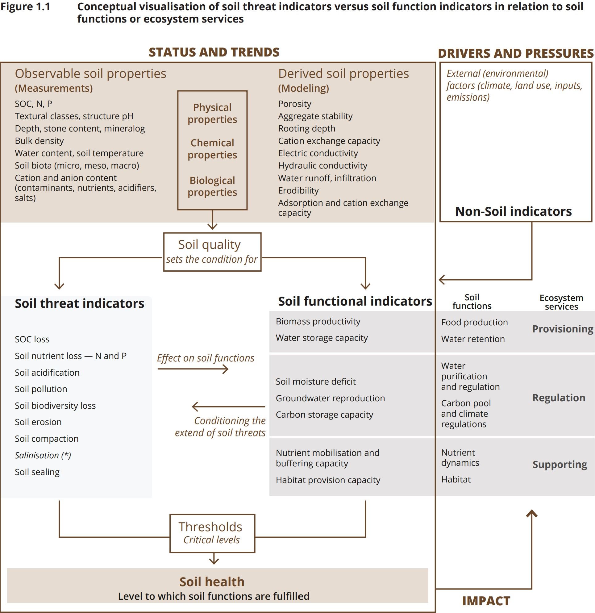
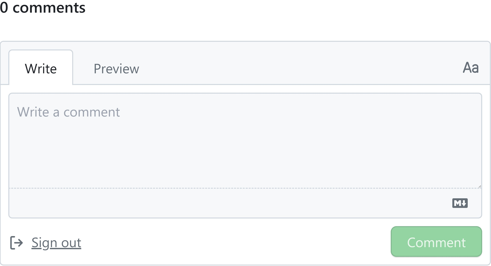

# Soil Health Knowledge Graph

[](https://creativecommons.org/licenses/by/4.0/)
[](https://doi.org/10.5281/zenodo.14936019)

[](https://deepwiki.com/soilwise-he/soil-health-knowledge-graph)

<p>
<a href="http://oops.linkeddata.es">
</a>
</p>

## ✨ Abstract

Soil health is fundamental to environmental sustainability and food security, yet relevant knowledge remains fragmented across diverse sources, hindering its effective application. Knowledge graphs (KGs) offer a robust solution by integrating disparate information into a structured, semantically rich format. Addressing this need, this paper presents an ontology-compliant **soil health knowledge graph** (SHKG) derived from domain literature, and the semi-automated, human-in-the-loop pipeline developed to construct it. Our pipeline leverages **large language models** (LLMs) to accelerate knowledge extraction, while incorporating expert oversight to ensure ontological compliance and accuracy. The resulting KG integrates unstructured knowledge into **11,719 RDF triples** representing **2,017 entities**, including **1,785 soil-related concepts**. The KG's fidelity was confirmed by soil scientists through a validation process involving competency questions. We demonstrate the KG's primary use case as the backbone for a knowledge discovery system in soil science. The KG, supporting ontology, and the source code of the pipeline are available here.

---

## 📚 Knowledge Sources

This work draws on the following primary resources:

* **EEA (2023).** *Soil monitoring in Europe – Indicators and thresholds for soil health assessments*.  
* **EEA (2024).** *The state of soils in Europe – Fully evidenced, spatially organised assessment of the pressures driving soil degradation*.

---

## 🧩 Conceptual Model

The high‑level structure of the SHKG follows the conceptual model from the EEA 2023 report (Figure 1.1). We have RDF‑ized this model into our top-level schema:



* **RDF representation**: see [`top_level_KG.ttl`](top_level_KG.ttl)

---

## 📈 Overview of the soil health KG

Illustration of the high-level structure of the soil health KG:


## 🛠️ Pipeline of KG Construction

We utilized a pipeline that incorporates LLMs for the extraction of relevant information from the source text, followed by post-processing and alignment with established ontologies:


---

## 📦 Repository Contents

```
.
├── LICENSE
├── README.md
├── requirements.txt          # Python dependencies
├── KGC_pipeline.ipynb        # Jupyter notebook demonstrating the full KG‑construction pipeline
├── uk2us.py                  # Utility script (UK ↔ US spelling normalizer)
│
├── top_level_KG.ttl          # High-level structure of the SHKG, derived from the conceptual model (RDF/Turtle)
├── soil_health_KG.ttl        # Full Soil Health KG (RDF/Turtle)
├── soil_health_SKOS.ttl      # SKOS version of SHKG for publishing on AgroPortal (RDF/Turtle)
├── shKG_metadata.ttl         # Metadata describing the KG
├── example_SWR.trig          # Example SoilWise knowledge repository (TriG)
│
├── CQs_sparql_queries/       # SPARQL queries translated from competency questions
├── ex_ontovocabs/            # Linked external vocabularies & thesauri
├── in_ontovocabs/            # Imported ontologies & schemas
├── benchmarks/
│   ├── text_RDF_gs.json       # Text-to-RDF gold standard benchmark
│   └── CQs_SPARQL_ea.json     # Competency question, SPARQL query, and expected answer dataset for KG validation
├── imgs/
└── …
```

---

## 🚀 Quick Start

1. **Clone** this repository

   ```bash
   git clone https://github.com/soilwise-he/soil-health-knowledge-graph.git
   cd soil-health-knowledge-graph
   ```

2. **Install** dependencies

   ```bash
   pip install -r requirements.txt
   ```

3. **Explore the KG**

   * Load the main graph in Python or any RDF tool:

     ```python
     from rdflib import Graph
     g = Graph().parse("soil_health_KG.ttl", format="turtle")
     print(len(g), "triples loaded")
     ```

   * Run example SPARQL queries in `CQs_sparql_queries/` or via the public endpoint at:
     [https://repository.soilwise-he.eu/sparql/](https://repository.soilwise-he.eu/sparql/)

4. **Run the pipeline**
   Open and run `KGC_pipeline.ipynb` to see:

   * LLM‑driven triple generation (via GPT‑4o prompts)
   * Turtle syntax check & repair
   * Ontology alignment, entity normalization & relation disambiguation
   * KG enrichment (invertible relations, external vocabularies)
   * KG validation
   * Example SoilWise knowledge repository (interlink with harvested Zenodo metadata records)

---

## 🔗 Resource Availability

* **Interactive Browser**:  [https://soilwise-he.github.io/soil-health](https://soilwise-he.github.io/soil-health)
* **SPARQL Endpoint**:  [https://repository.soilwise-he.eu/sparql/](https://repository.soilwise-he.eu/sparql/)
* **Searchable Vocabulary Browser**:  [https://voc.soilwise-he.containers.wur.nl/](https://voc.soilwise-he.containers.wur.nl/)
* **AgroPortal Instance**:  [https://agroportal.lirmm.fr/ontologies/SHKG](https://agroportal.lirmm.fr/ontologies/SHKG)

---

## 🔗 Imported Ontologies & Schemas

To ensure our soil health KG aligns with recognized standards, we incorporate a variety of well-established ontologies and schemes.

* [SKOS Core](https://www.w3.org/2009/08/skos-reference/skos.html)
* [Dublin Core](https://www.dublincore.org/specifications/dublin-core/)
* [RDF Schema](https://www.w3.org/TR/rdf-schema/)
* [Agrontology](https://aims.fao.org/aos/agrontology)
* [Semanticscience Integrated Ontology (SIO)](https://sio.semanticscience.org/)
* [Open Biological and Biomedical Ontology (OBO)](https://obofoundry.org/)
* [QUDT](https://qudt.org/)
* [Ontology of Units of Measure (OM)](http://www.ontology-of-units-of-measure.org/resource/om-2/)
* [PROV-O](https://www.w3.org/TR/prov-o/)
* [Schema.org](https://schema.org/)
* [SWEET ontology](http://sweetontology.net/)
* [Wikidata](https://www.wikidata.org/)
* [Biolink Model](https://biolink.github.io/biolink-model/)
* [Allotrope Foundation Ontology](https://www.allotrope.org/ontologies)
* [REPRODUCE-ME Ontology](https://w3id.org/reproduceme)
* [BioAssay Ontology (BAO)](http://bioassayontology.org/)
* [Time Ontology](https://www.w3.org/TR/owl-time/)

The KG leverages **19 classes** and **205 properties** drawn from above ontologies to formally define the types of entities and their relationships. All 19 classes come from existing ontologies, while **45** of the 205 properties are defined by us and the rest come from existing ontologies.

## 🔗 Linked Vocabularies & Thesauri

The KG is enriched by interlinking to controlled vocabularies and thesauri in the field of soil science to align with standard terminologies.

* [AGROVOC](http://aims.fao.org/aos/agrovoc)
* [ISO 11074:2025](https://data.geoscience.earth/ncl/ISO11074v2025)
* [GloSIS ontology](https://glosis-ld.github.io/glosis/)
* [INRAE Thesaurus](http://opendata.inrae.fr/thesaurusINRAE/)
* [GEMET Thesaurus](https://www.eionet.europa.eu/gemet/)

---

## 💡 Usecases

1. **Semantic Backbone** for a broader SoilWise knowledge repository, an [example](https://github.com/soilwise-he/soil-health-knowledge-graph/blob/main/example_SWR.trig) of interlinking with harvested Zenodo metadata records is provided.
2. **Natural‑language Question Answering** over the KG via NL → SPARQL
3. **Benchmark** for text2KG: converting scientific text → ontology‑compliant RDF

---

## 🗣️ Feedback

* **Concept-specific comments**  
  To leave comments on any individual concept, visit the [Soilwise HE Data and Knowledge hub](https://voc.soilwise-he.containers.wur.nl/), search for your concept of interest, then scroll down to the **Comments** section (as shown in the screenshot below) and post your feedback directly there.

  

* **Missing concepts**  
  If you believe a soil‑health concept is missing from the SHKG, please open a new [GitHub issue](https://github.com/soilwise-he/soil-health-knowledge-graph/issues) to let us know.

---

## 📝 How to Cite

```bibtex
@inproceedings{wang2025soil,
  author    = {Beichen Wang and Luís Moreira de Sousa and Anna Fensel},
  title     = {Make soil healthy again: Construction of ontology-compliant soil health knowledge graph with large language models},
  booktitle = {Proceedings of the 13th Knowledge Capture Conference 2025},
  year      = {2025},
  doi       = {10.1145/3731443.3771730}
}
```

---

## 🙏 Acknowledgements

This work was supported by the EU's Horizon Europe research and innovation programme within the [SoilWise](https://cordis.europa.eu/project/id/101112838) project (grant agreement ID: 101112838).

## 📝 To-do

See [Issues](https://github.com/soilwise-he/soil-health-knowledge-graph/issues) for planned tasks and enhancements.

---

## 📄 License

* **Code**: MIT License  [See `LICENSE`](./LICENSE)
* **Data & Ontologies**: CC BY 4.0  (Creative Commons Attribution 4.0 International)
